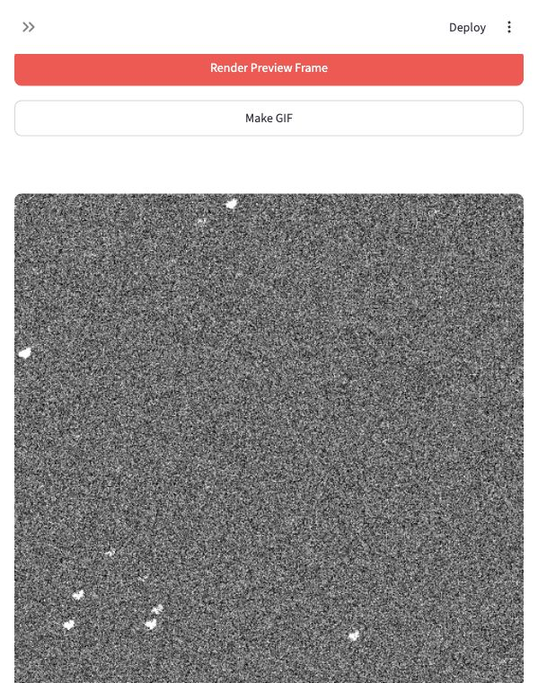

# Satellite Pointing and Starfield Simulator

A deployable Streamlit interface for simulating small-satellite pointing error, evaluating MPE/RPE-style metrics, and rendering grayscale starfield frames or GIFs driven by the pointing trajectory.



## Features

- Pointing simulation ported from `simulate_pointingv3.m`.
- MPE, RPE, and global pointing metrics in degrees and arcseconds.
- Save/load pointing simulations as `.npz` files.
- Starfield rendering with telescope, sensor, target-field, background, preview, and GIF controls.
- Exposure-integrated star motion for jitter/drift trails.
- Online catalog queries against APASS and Gaia TAP services, with a synthetic fallback for offline demos.
- Grayscale preview/GIF rendering with an embedded arcsecond scale bar.

## Run locally

Requirements:

- Python 3.11 or newer
- Git, or a downloaded ZIP of this repository
- Internet access for APASS/Gaia catalog queries

```bash
git clone https://github.com/YOUR-ACCOUNT/satellite-imaging-simulation.git
cd satellite-imaging-simulation

python3 -m venv .venv
source .venv/bin/activate
pip install -r requirements.txt
streamlit run app.py
```

On Windows, activate the environment with:

```powershell
.venv\Scripts\activate
```

After running `streamlit run app.py`, open the local URL printed by Streamlit, usually:

```text
http://localhost:8501
```

## Deploy on Streamlit Community Cloud

1. Push this repository to GitHub.
2. Go to Streamlit Community Cloud.
3. Create a new app.
4. Select this repository and branch.
5. Set the main file path to:

```text
app.py
```

6. Deploy.

Streamlit Cloud will install packages from `requirements.txt` automatically.

## Notes

- Catalog mode uses APASS/Gaia stars only; resolved objects such as galaxies are not rendered.
- Synthetic fallback is intended for offline demonstrations and repeatable tests.
- Large sensors, long GIF durations, and faint magnitude limits can be CPU intensive.

## License

MIT License. Copyright (c) 2026 Prof. Duncan Wright, The University of Southern Queensland.
